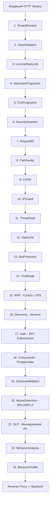

# AEGIS: Полный технический справочник архитектуры и устройства системы (от А до Я)

> **Статус документа:** внутренний технический справочник.  
> **Версия системы:** номера версии у продукта нет — в коде его не существует, и
> выдуманный номер первым же вопросом превращается в разговор о том, что ещё
> выдумано. Состояние описывается зрелостью, а не цифрой: TRL 5.  
> **Язык разработки:** Go 1.26 (`go.mod`) / TypeScript + React 19 (консоль).  
> **Целевое назначение:** техническая документация для архитектурного аудита
> грантов (PARP, Horizon Europe, EIC) и due diligence инвестора.
>
> **Чем этот документ проверен.** Каждое число и каждое имя ниже сверено с
> кодом командой, а не памятью. Первая редакция содержала одиннадцать
> расхождений — включая пять несуществующих переменных окружения в разделе
> развёртывания и обещание отпечатков JA4, рядом с которым в самом коде стоит
> примечание, что JA4 сознательно вне области. Такие ошибки опаснее пробелов:
> проверяющий, нашедший одну, перепроверяет всё остальное.
>
> Статус функций живёт в [`../ROADMAP.md`](../ROADMAP.md), позиционирование —
> в [`PRODUCT.md`](PRODUCT.md), гейт релиза — в
> [`../RELEASE-CHECKLIST.md`](../RELEASE-CHECKLIST.md). Где этот документ
> расходится с кодом — прав код.

---

## 1. Концепция и философия системы

AEGIS — это специализированный высокопроизводительный шлюз безопасности API (API Security Gateway & Compliance Sidecar). В отличие от классических CDN/WAF общего назначения (Cloudflare, AWS WAF), AEGIS спроектирован под специфику современных REST/GraphQL API и регуляторные требования Европейского Союза (**NIS2 Директива, ст. 23** и **DORA Регламент, ст. 17–19**).

### Ключевые архитектурные принципы:
1. **Двухконтурная модель (Dual-Plane Architecture):** Полное физическое разделение портов и цепочек обработки данных (`Data-Plane` — проксирование пользовательского трафика) и управления (`Admin-Plane` — аналитика, API инвентарь, аудит и консоль оператора).
2. **Нулевое доверие к входящим заголовкам (Clean-Slate Ingress):** Все служебные и маршрутизирующие заголовки (`X-Gateway-*`, `X-Forwarded-*`, `X-JA3-*`, `X-Tenant-*`) зачищаются или пересчитываются шлюзом на границе сети.
3. **Криптографическая доказуемость (Tamper-Evidence):** Журналы инцидентов и аудита связываются в криптографические хеш-цепочки и заверяются цифровыми подписями Ed25519 с фиксацией деревьев Меркла.
4. **Защита приватности (Privacy by Default):** Шлюз работает on-premise или в приватном облаке заказчика. В отличие от зарубежных решений (Noname, Salt, Traceable), данные и ключи не покидают периметр компании.

---

## 2. Структура проекта и инвентарь пакетов

Кодовая база — около 56 000 строк Go: 27 700 продуктового кода и 28 200
тестового. Тестового больше, чем продуктового, и это стоит называть в таком
порядке — соотношение 1:1 здесь не фигура речи.

```
/Users/maczone/api/
├── cmd/
│   ├── gateway/           # Точка входа: инициализация, DI, graceful shutdown, hot-reload
│   ├── licensegen/        # Утилита выпуска коммерческих лицензий (Ed25519 подпись)
│   ├── licenseserver/     # Сервер удаленной валидации лицензий
│   └── reportverify/      # CLI для автономной верификации подписанных отчетов регуляторам
├── config/                # Конфигурационные файлы YAML (gateway.yaml, gateway.ci.yaml)
├── charts/aegis/          # Production-grade Helm-чарт (Deployment, HPA, PDB, NetworkPolicy)
├── demo/                  # Стенды демонстрации, генераторы трафика, sample reports
├── docs/                  # Документация, грантовые роадмапы, ранбуки, security-гайды
├── internal/              # 26 изолированных внутренних пакетов Go (инвентарь ниже)
├── scripts/               # CI/CD скрипты, валидаторы инвариантов, префлайт-чеки
├── tests/                 # Скрипты пентеста (pentest.sh) и нагрузочные тесты (loadgen)
└── web/console/           # React 18 + TypeScript + Vite веб-консоль оператора
```

### Назначение всех 26 пакетов `internal/`:

| Пакет | Ответственность |
|---|---|
| `alert` | Алертинг: Slack и generic webhook с дедупликацией и rate-limit. Почтового канала нет |
| `api` | Admin-Plane REST API, аутентификация консоли, сессии, CSRF, CRUD тенантов и инцидентов |
| `attest` | Асимметричная криптография Ed25519: генерация ключей, выпуск подписей, верификация отчетов |
| `audit` | Журналирование действий администраторов с RLS-изоляцией и контролем целостности |
| `classify` | Классификатор PII: карты (алгоритм Луна), SSN, email, телефон. IBAN не реализован |
| `config` | Парсинг YAML, валидация типов, оверрайды из ENV, защита от insecure-плейсхолдеров |
| `discovery` | Пассивный анализ API: каталог эндпоинтов, Shadow API, дрифт OpenAPI-спецификаций |
| `forensic` | Хранение форензик-логов в PostgreSQL, почасовые печати Меркла, цепочки доказательств |
| `gateway` | Сборка конвейеров мидлварей, запуск HTTP-серверов данных и администрирования |
| `gql` | Парсер AST GraphQL: извлечение операций, полей и аргументов ID для BOLA-анализа |
| `iam` | Хранилище пользователей, хеширование паролей bcrypt, RBAC (Admin, Viewer, SuperAdmin) |
| `incident` | Реестр инцидентов NIS2/DORA, корреляция атак, журнал состояний с хеш-цепочками |
| `license` | Проверка коммерческих лицензий, аппаратный фингерпринт MAC-адресов, контроль RPS |
| `logger` | Структурированное JSON-логирование, контекстные поля, события блокировок |
| `middleware` | 23 шага конвейера обработки трафика Data-Plane (сердце шлюза) |
| `pglock` | Консультативные блокировки PostgreSQL (advisory locks) для атомарности цепочек |
| `pgtest` | Тестовые фикстуры и запуск изолированных баз данных PostgreSQL для тестов |
| `proxy` | Reverse Proxy на базе `httputil`: Round-Robin балансировщик, Circuit Breaker, ретраи |
| `retention` | Фоновый воркер очистки устаревших данных по политикам GDPR / retention |
| `safefetch` | Безопасный HTTP-клиент: защита от SSRF на уровне сокета `net.Dialer.Control` |
| `secevent` | Унифицированная структура события безопасности для всех анализаторов шлюза |
| `sso` | OIDC / OAuth2 аутентификация операторов через внешний IdP с поддержкой PKCE S256 |
| `store` | Слой хранения в Redis: скользящие лимиты, сессии, BOLA HyperLogLog, бан-листы |
| `tenant` | Передача идентификатора тенанта в контексте `context.Context` |
| `ticket` | Адаптеры интеграции с трекерами: Jira и ServiceNow (GitHub Issues нет) |
| `tlsfp` | Отпечаток TLS ClientHello в стиле JA3 для детекта ботов. Не канонический JA3 и не JA4 — см. §6.6 |

---

## 3. Конвейер обработки данных (Data-Plane: 23 шага)

Порядок следования мидлварей строго зафиксирован архитектурным тестом `TestChainSteps_OrderIsLoadBearing`. Нарушение порядка создает уязвимости обхода.



### Подробный разбор каждого шага:

1. **`TenantResolve` (Изоляция тенанта):** Опирается на модель «B + A». Приоритет B (авторитетный): маршрут роута в конфиге; A (вспомогательный): `Host`/SNI заголовок. Записывает ID тенанта в `r.Context()`. Несовпадение Host и Route пресекается 404 (без раскрытия существования тенантов).
2. **`CleanHeaders` (Зачистка входящих заголовков):** Удаляет любые клиентские `X-Gateway-*` (предотвращая спуфинг ролей), `X-JA3-Fingerprint`, а также семейство `X-Forwarded-*`, если непосредственный TCP-пир не входит в список `trusted_proxies`.
3. **`LicenseRateLimit` (Лицензионный потолок):** Проверяет непревышение глобального RPS купленной лицензии. Выполняется до тяжелых проверок для минимизации CPU при перегрузке.
4. **`UpstreamFingerprint`:** Считывает JA3-заголовки от доверенных CDN (например, Cloudflare).
5. **`TLSFingerprint`:** Извлекает реальный JA3 хэш из сокета ClientHello TLS-хэндшейка.
6. **`SecurityHeaders`:** Внедряет в ответ защитные заголовки (`X-Content-Type-Options: nosniff`, `X-Frame-Options: DENY`, `Strict-Transport-Security`).
7. **`RequestID`:** Генерирует или валидирует сквозной `X-Request-ID` для трассировки.
8. **`PathSanity` (Нормализация путей):** Отсекает атаки обхода каталогов до принятия решений маршрутизации. Блокирует двойное кодирование (`%252e`), скрытые разделители (`%2f`, `%5c`), матричные параметры Java Tomcat/Jetty (`;jsessionid`), невалидный UTF-8.
9. **`CORS`:** Обрабатывает preflight-запросы `OPTIONS`, сверяет Origin с белым списком, выставляет `Vary: Origin`.
10. **`IPGuard`:** Проверяет IP по белым/черным спискам CIDR, а также по динамической базе заблокированных адресов в Redis (перманентные блокировки и активные автобаны).
11. **`ThreatFeed`:** Проверяет репутацию IP по локальным базам фидов угроз (Tor exit nodes, сканеры, спамхаусы).
12. **`RateLimit`:** Скользящее/фиксированное окно частотных ограничений на базе атомарного Lua-скрипта в Redis. Поддерживает per-route оверрайды.
13. **`BotProtection`:** Сверяет User-Agent и TLS-фингерпринт с профилями автоматизированных сканеров (sqlmap, nikto, masscan).
14. **`Challenge`:** Механизм Proof-of-Work / JS-челленджа для подозрительных клиентов.
15. **`WAF` (Web Application Firewall):** Полнофункциональный WAF на движке Coraza v3 с поддержкой набора правил OWASP Core Rule Set (CRS) v4. Инспектирует SQLi, XSS, RCE, LFI, Log4Shell, XXE.
16. **`Discovery` (Пассивный сбор API):** Анализирует структуру запроса, метод и шаблон пути, обновляя статистику в каталоге эндпоинтов и выявляя теневые (Shadow) API.
17. **`Auth` (JWT аутентификация):** Проверяет JWT токены через локальный HMAC/RSA секрет либо удаленный JWKS. Проверяет срок действия, аудиторию, издателя, защиту от algorithm confusion (`alg: none` или подмена HMAC/RSA). Проверяет флаг отзыва токена по JTI в Redis.
18. **`ConsumerID` (Псевдонимизация клиентов):** Если токен непрозрачный (Opaque Bearer, API-Key, Cookie), генерирует криптографический псевдоним `token:HMAC-SHA256(secret, credential)[:16]`. Это связывает запросы клиента в единый профиль без раскрытия секрета в логах.
19. **`SchemaValidation` (Позитивная безопасность):** Сверяет входящий JSON с загруженной OpenAPI 3.0 схемой для данного маршрута.
20. **`AbuseDetection` (Детектор BOLA / BFLA):**
    * **BFLA:** Проверяет, обладает ли роль из JWT правом вызова привилегированного маршрута.
    * **BOLA / IDOR:** Вычисляет уникальные ID объектов через HyperLogLog в Redis. При аномальном всплеске перебора чужих ID (EnumThreshold или адаптивный baseline) формирует алерт или блокирует атакующего.
21. **`DLP` (Data Loss Prevention):** Перехватывает поток ответа бэкенда, ищет конфиденциальные данные (номера карт, SSN, IBAN) и маскирует их звездочками (`4532-****-****-8811`).
22. **`BehaviorAnalysis`:** Вычисляет карма-скор клиента по истории предыдущих ответов (ошибки 4xx, срабатывания WAF). При превышении лимита автоматически отправляет IP в бан. Сознательно fail-open: при недоступности Redis пробел в скоринге лучше, чем блокировка всего трафика.
23. **`BehaviorProfile`:** Отдельный шаг, а не часть предыдущего. Ведёт персональный бейзлайн потребителя по четырём названным измерениям (объём, отказы авторизации, отсутствующие пути, разброс эндпоинтов); каждая находка сообщает, какое измерение и на сколько отклонилось. Порядок шагов закреплён тестом `TestChainSteps_OrderIsLoadBearing` — он же содержит причину каждого правила.

---

## 4. Контур администрирования (Admin-Plane & Console)

Административный сервер слушает отдельный порт (по умолчанию `:8081`). Ни один административный маршрут физически не доступен через data-plane порт (`:8080`).

### Цепочка безопасности Admin-Plane:
```
RequestID -> SecurityHeaders -> RateLimit (5 req/s, probes exempt) -> AdminAuth -> CORS -> Handlers
```

* **Аутентификация администратора (`AdminAuth`):**
  1. **Bearer Secret (`AEGIS_ADMIN_SECRET`):** Сервисный доступ для CI/CD, скриптов реагирования и SOAR. Сравнение выполняется строго через `subtle.ConstantTimeCompare`.
  2. **Session Cookie (`aegis_session`):** 64-значный криптографический токен в cookie (`HttpOnly`, `SameSite=Lax/Strict`, `Secure`). Данные сессии хранятся в Redis с TTL.
* **Защита от CSRF:** Двойной submit токена (`Double-Submit Cookie`). Мутирующие запросы (`POST`, `PUT`, `DELETE`, `PATCH`) обязаны присылать заголовок `X-CSRF-Token`, совпадающий с cookie `aegis_csrf`.
* **RBAC:** Две роли операторов:
  * `viewer`: Доступны только `GET`-запросы (просмотр метрик, инцидентов, каталога). Любая мутация отклоняется с кодом `403 Forbidden`.
  * `admin`: Полный доступ к операциям управления.
  * Флаг `SuperAdmin`: Разрешает межтенантные операции, создание тенантов и глобальные блокировки.
* **Защита от перебора паролей:** В `auth_handlers.go` реализованы независимые счетчики per-IP и per-account в Redis с предварительным резервированием слота попытки до вызова ресурсоемкого `bcrypt`.

---

## 5. Слой хранения данных (Storage & Persistence)

AEGIS использует гибридную модель хранения: **Redis** для оперативных данных реального времени и **PostgreSQL** для долговременных журналов с Row-Level Security.

### А. Redis (In-Memory Key Schema)

Все ключи изолированы пространством имен тенантов: `gw:t:<tenant_id>:<suffix>`.

| Ключ | Тип | Назначение |
|---|---|---|
| `gw:t:<tenant>:rate:<key>` | String (Integer) | Счетчик rate-limiting с TTL окна (Lua-скрипт) |
| `gw:t:<tenant>:blocked_ips` | Set | Постоянный черный список IP тенанта |
| `gw:global:blocked_ips` | Set | Глобальный черный список IP (на весь шлюз) |
| `gw:t:<tenant>:autoban_active:<ip>` | String | Временный бан IP поведенческим анализом (с TTL) |
| `gw:t:<tenant>:jwt:revoked:<jti>` | String | Отозванный идентификатор токена JWT (с TTL) |
| `gw:global:jwt:revoked:<jti>` | String | Глобально отозванный JWT (на все тенанты) |
| `gw:session:<token>` | String (JSON) | Серверная сессия оператора консоли |
| `gw:oidc:flow:<state>` | String (JSON) | Одноразовый контекст OIDC PKCE (потребляется через `GETDEL`) |
| `gw:t:<tenant>:bola:<consumer>:<endpoint>` | HyperLogLog | Оценка мощности множества уникальных ID объектов для BOLA |
| `gw:t:<tenant>:objowner:<endpoint>:<id>` | String | Подтвержденный владелец объекта (из ответа бэкенда) |
| `gw:t:<tenant>:metrics:<name>` | String (Integer) | Метрики трафика и срабатываний защит |

### Б. PostgreSQL (Таблицы и Row-Level Security)

Для каждой таблицы включен механизм **PostgreSQL Row-Level Security (RLS)**:
```sql
ALTER TABLE api_endpoints ENABLE ROW LEVEL SECURITY;
CREATE POLICY tenant_isolation_endpoints ON api_endpoints
    USING (tenant_id = current_setting('app.tenant_id', true) OR current_setting('app.tenant_id', true) = '*');
```
Перед любым запросом транзакция выставляет переменную сессии:
`SELECT set_config('app.tenant_id', $1, true)` (параметр `is_local=true` гарантирует сброс настройки по завершении транзакции). Даже при наличии ошибки в логике приложения один тенант физически не может прочитать строки другого тенанта на уровне движка СУБД.

---

## 6. Глубокий разбор подсистем безопасности

### 1. Защита от SSRF (`internal/safefetch`)
Проверка URL на уровне регулярных выражений ненадежна (уязвима к DNS Rebinding, десятичным IP `2130706433`, IPv6-отображениям `::ffff:127.0.0.1`). 
`safefetch` перехватывает соединение в хуке `net.Dialer.Control`:
1. DNS-резолвинг выполняется на сокете операционной системы.
2. Хук `Control` вызывается для **каждого разрешенного IP-адреса** непосредственно перед установлением TCP-соединения.
3. Блокируются диапазоны:
   * Loopback (`127.0.0.0/8`, `::1`)
   * Private RFC 1918 (`10.0.0.0/8`, `172.16.0.0/12`, `192.168.0.0/16`)
   * Link-Local / Облачные метаданные AWS/GCP/Azure (`169.254.169.254`, `169.254.0.0/16`, `fe80::/10`)
   * Multicast (`224.0.0.0/4`)
4. Попытка редиректа с внешнего хоста на внутренний отслеживается через `CheckRedirect` (до 5 хопов с повторной валидацией каждого).

### 2. Детектор BOLA / IDOR (`internal/middleware/abuse.go`)
* **Извлечение ID объектов:** Алгоритм `bolaTargets` извлекает ID из трех источников:
  1. Путь URL: поиск числовых ID (`/orders/12345`) и UUID по регулярным выражениям.
  2. Query-параметры: поиск аргументов `id`, `*_id`, `*Id` (`?order_id=42`).
  3. JSON Body: парсинг верхнеуровневых полей и данных `data` с поддержкой одиночных значений и батчей (`{"ids": [1, 2, 3]}`). При частичном усечении тела применяется fallback-парсер токенов.
  4. GraphQL: AST-парсер анализирует имя операции и аргументы типа `user(id: 42)`.
* **Подсчет мощности (HyperLogLog):** Для экономии памяти используется структура `PFADD` в Redis. Вместо хранения миллионов строк HyperLogLog использует 12 КБ памяти на пару (клиент, эндпоинт), выдавая количество уникальных затронутых объектов с погрешностью < 1%.
* **Адаптивный бейзлайн:** Шлюз учит нормальное поведение потребителя. Если клиент обычно трогает 5 объектов за окно, а затем резко запрашивает 40 — срабатывает алерт, даже если абсолютный лимит (EnumThreshold = 50) ещё не достигнут.

### 6. Отпечаток TLS (`internal/tlsfp`) — и чего он не делает

Раздел вынесен отдельно, потому что здесь проще всего переобещать.

Стандартная библиотека Go отдаёт `tls.ClientHelloInfo`, но **не** отдаёт
упорядоченный список расширений. Канонический JA3 хеширует именно его. Значит
то, что вычисляет AEGIS, — не побайтово канонический JA3, и тем более не JA4:
это устойчивый отпечаток в стиле JA3 по полям, которые stdlib открывает (версия
TLS, наборы шифров, кривые, форматы точек EC, ALPN).

Чего это достаточно: опознавать и связывать клиентские стеки — ботофермы,
ротаторы прокси. Чего недостаточно: сверяться с публичными базами сигнатур JA3.

Выбор сознательный и записан в самом коде (`internal/tlsfp/tlsfp.go`, примечание
в шапке пакета): свой парсер ClientHello ради канонической формы против
отпечатка, который клиент не может подделать в принципе, потому что берётся из
сокета, а не из заголовка. Предыдущая версия читала `X-JA3-Fingerprint` от
клиента — то есть верила тому, кого проверяла.

### 3. Data Loss Prevention (DLP, `internal/middleware/dlp.go`)
* Буферизует поток ответа бэкенда до 4 МБ (настраивается).
* Стриппит заголовок `Accept-Encoding`, принуждая бэкенд отдавать несжатый текст (иначе gzip маскировал бы PII).
* Классификаторы `internal/classify`:
  * Номера банковских карт: поиск последовательностей 13–19 цифр с обязательной валидацией по **контрольной сумме алгоритма Луна (Luhn Check)**. Это полностью исключает ложные срабатывания на артикулы товаров и случайные числа.
  * Номера социального страхования (US SSN).
  * Email-адреса и телефонные номера. Детектора IBAN нет.
* Режимы (`DLPConfig`): по умолчанию — маскирование символом `*`; `observe`
  классифицирует и помечает наблюдение найденными типами PII, но тело ответа не
  изменяет (режим пилота); `fail_closed` отказывает в ответе, который DLP не
  смог проинспектировать — слишком большое тело или недекодируемая кодировка, —
  со статусом `502 Bad Gateway`. Поля `block_mode` у DLP нет.
* Почему `fail_closed` по умолчанию выключен и почему это признаётся спорным:
  размер ответа часто во власти вызывающей стороны (лимит пагинации, диапазон
  выгрузки), поэтому умолчание отдаёт единственный редактирующий PII контроль
  на отключение тому, кого он ограничивает. Умолчание выбрано в пользу
  доступности, пропуск логируется и считается.

### 4. Неизменяемый журнал инцидентов NIS2 / DORA (`internal/incident`)
* Статья 23 NIS2 и статьи 17–19 DORA обязывают организации вести учет существенных инцидентов ИБ и информировать регуляторов в течение 24–72 часов.
* Таблица `incidents` регистрирует инциденты, агрегируя события безопасности (WAF блокировки, перебор BOLA, утечки DLP).
* **Журнал состояний (`incident_ledger`):** Каждое изменение статуса (open -> contained -> closed) порождает запись в append-only реестре:
  $$\text{StateDigest} = \text{SHA256}(\text{id} \parallel \text{status} \parallel \text{severity} \parallel \text{event\_count} \parallel \dots)$$
  $$\text{ChainDigest}_N = \text{SHA256}(\text{ChainDigest}_{N-1} \parallel \text{StateDigest}_N \parallel \text{Seq}_N \parallel \text{Op}_N)$$
* Цепочка даёт: удаление строки, правка задним числом или отсечение хвоста
  ломают контрольную сумму при вызове `GET /api/incidents/ledger`.
* Чего цепочка **не** даёт, и это надо произносить самому, не дожидаясь
  вопроса. Правильное слово — tamper-**evident**, а не tamper-proof. Ключ
  подписи держит та сторона, которую проверяют, поэтому подпись доказывает
  «документ не изменён после создания», а не «собран из полных данных».
  Оператор, владеющий ключом, может переписать запись и переподписать её.
  Закрывается это только внешним якорем — центром штампов времени (RFC 3161)
  или прозрачным журналом; он не реализован, и ни один документ здесь не
  утверждает обратного (см. §10, пункт 3 плана R&D). Формулировка
  «юридически доказуемо» в таком виде необоснованна и здесь не используется.

### 5. Почасовые печати логов Меркла (`internal/forensic/seal_store.go`)
* Фоновый планировщик каждый час закрывает временной интервал $[T_{\text{start}}, T_{\text{end}})$.
* Все хэши событий за час упорядочиваются и сворачиваются в дерево Меркла (Merkle Tree).
* Корень дерева Меркла (Merkle Root) связывается с корнем предыдущего часа:
  $$\text{Seal}_N = \text{Ed25519\_Sign}(\text{MerkleRoot}_N \parallel \text{PrevRoot}_{N-1} \parallel \text{Tenant} \parallel \text{Seq}_N)$$
* Заверенная подпись сохраняется в `forensic_seals`. Внешний аудитор проверяет
  её утилитой `cmd/reportverify` на своей машине, не доверяя ни оператору, ни
  нам: верификатор отказывается работать с ключом, взятым из проверяемого
  документа.
* Граница та же, что и у реестра инцидентов: проверка устанавливает, что
  запечатанный набор событий не изменён после запечатывания. Она не
  устанавливает, что в этот набор попало всё, что произошло. Каждый
  подписываемый документ содержит раздел ограничений — система отказывается
  подписывать документ без него.

---

## 7. Отказоустойчивость и проксирование (`internal/proxy`)

Reverse Proxy построен на базе `net/http/httputil` с глубокими доработками:
1. **Балансировка нагрузки:** Поддерживается `round_robin` с атомарным циклическим счетчиком.
2. **Circuit Breaker (Автоматический предохранитель):**
   * Состояния: `Closed` (норма), `Open` (сервер лежит, запросы отсекаются сразу), `Half-Open` (пробный запрос).
   * При $N$ последовательных ошибках апстрим выводится из пула на время `reset_after`.
   * В состоянии `Half-Open` допускается строго 1 зондирующий запрос. При успехе предохранитель закрывается, при неудаче — снова уходит в `Open`.
3. **Безопасная буферизация повторов (`attemptWriter`):**
   * При сбое первого апстрима запрос к следующему повторяется только для идемпотентных методов (`GET`, `HEAD`, `OPTIONS`).
   * Буфер ограничен 4 МБ. При превышении лимита ответ переключается в сквозной стриминг, защищая память шлюза от OOM.
   * Протоколы реального времени (`text/event-stream` SSE и WebSocket) моментально коммитятся клиенту через интерфейсы `http.Flusher` и `http.Hijacker`.

---

## 8. Безопасность и архитектурные инварианты

В проекте действует автоматический скрипт контроля инвариантов безопасности
`./scripts/lint-invariants.sh`, запускаемый в `make preflight` и в CI. Инвариантов
**одиннадцать**; каждый — баг, который однажды прошёл в продукт и больше не
пройдёт. Полный список выдаёт сам скрипт; четыре для иллюстрации:

1. **Запрет `strings.HasPrefix` на путях:** Исключает уязвимость обхода префиксов (`/publicXYZ` вместо `/public`). Проверка выполняется строго через `config.PathHasPrefix`, учитывающий границы сегментов `/`.
2. **Защита от timing-атак при логине:** При вводе несуществующего логина система выполняет фиктивный расчет `bcrypt` над dummy-хешем, уравнивая время ответа с проверкой реального пользователя и предотвращая перебор учетных записей по задержкам.
3. **Безопасный разбор X-Forwarded-For:** Метод `RealIP` анализирует цепочку IP **справа налево** (от последнего сетевого узла), отбрасывая доверенные прокси. Атакующий не может подделать свой IP добавлением фейковых адресов в начало заголовка.
4. **Запрет слабых паролей по умолчанию:** Метод `config.Validate` блокирует запуск бинарника, если `AEGIS_ADMIN_SECRET`, JWT секреты или пароль супер-админа установлены в стандартные плейсхолдеры (`changeme`, `secret`, `password`).

---

## 9. Руководство по развертыванию и эксплуатации

### Разделение: секреты — из окружения, всё остальное — из YAML

Это не стилистика, а правило: конфигурационный файл коммитится, попадает в
образ и в тикет, поэтому в нём не должно быть ничего, что нельзя показать.
`config.Validate` отказывается стартовать, если секрет оставлен плейсхолдером
или админский секрет короче минимума.

**Только из окружения** (`applyEnvOverrides`, `internal/config`):

| Переменная | Назначение |
|---|---|
| `AEGIS_ADMIN_SECRET` | Bearer-доступ к admin-plane для CI/CD и SOAR |
| `AEGIS_ROOT_EMAIL` / `AEGIS_ROOT_PASSWORD` | Учётные данные первого входа в консоль |
| `AEGIS_JWT_SECRET` | Секрет проверки JWT (HMAC) |
| `AEGIS_CONSUMER_SALT` | Соль псевдонимизации потребителей — без неё каталог обратим |
| `AEGIS_PROPAGATION_SECRET` | Ключ подписи проброшенной личности (`X-Gateway-Signature`) |
| `AEGIS_REPORT_SIGNING_KEY` | Ed25519 для подписи отчётов регулятору |
| `AEGIS_FORENSIC_DSN` | DSN PostgreSQL: форензика, каталог, инциденты |
| `AEGIS_REDIS_PASSWORD`, `AEGIS_REDIS_SENTINEL_PASSWORD` | Доступ к Redis и Sentinel |
| `AEGIS_OIDC_CLIENT_ID`, `AEGIS_OIDC_CLIENT_SECRET` | Вход операторов через внешний IdP |
| `AEGIS_ALERT_WEBHOOK_URL` | Приёмник алертов (Slack / generic) |
| `AEGIS_SPLUNK_HEC_TOKEN`, `AEGIS_ELASTIC_API_KEY` | Отправка событий в SIEM |
| `AEGIS_TICKET_TOKEN` | Доступ к Jira / ServiceNow |
| `AEGIS_LICENSE_PATH` | Путь к файлу лицензии |

**Только из YAML** (`config/gateway.yaml`) — переменных окружения для них нет:

* `listen` — адрес data-plane (по умолчанию `:8080`).
* `admin_listen` — адрес admin-plane (по умолчанию `:8081`).
* `redis.addr` — адрес Redis или Sentinel.
* `observe: true` — режим пассивного пилота: шлюз инспектирует и записывает, но
  ничего не блокирует.
* `mirror_sink: true` — зеркальный режим: шлюз принимает копию трафика и вообще
  не стоит в разрыве. Так начинается пилот.

<!-- doc-facts: ignore-env AEGIS_LISTEN AEGIS_ADMIN_LISTEN AEGIS_REDIS_ADDR AEGIS_POSTGRES_DSN AEGIS_OBSERVE -->

Первая редакция этого раздела перечисляла `AEGIS_LISTEN`, `AEGIS_ADMIN_LISTEN`,
`AEGIS_REDIS_ADDR`, `AEGIS_POSTGRES_DSN` и `AEGIS_OBSERVE`. Ни одной из них
шлюз не читает. Оставлено здесь как предупреждение: руководство по развёртыванию
проверяется запуском, а не вычиткой.

### Запуск через Docker Compose:
```bash
docker compose up -d
```
Поднимает связку: `aegis-gateway`, `redis`, `postgres`, тестовый бэкенд и сборщик метрик.

### Установка в Kubernetes через Helm:
```bash
helm install aegis ./charts/aegis -f ./charts/aegis/values-production.yaml
```

---

## 10. Резюме для грантовых комиссий и инвесторов

* **TRL 5, с аргументом за 6:** система работает целиком и проверена
  сквозным сценарием в собственной среде, собирается в один бинарник, тестового
  кода больше продуктового. До TRL 7 не хватает ровно одного — развёртывания на
  чужом реальном трафике. Это один пилот, а не год работы.
* **Коммерчески — ноль.** Ни пилота, ни платящего клиента, ни независимого
  пентеста. Это известный разрыв, и называть его первым дешевле, чем быть на
  нём пойманным: проверяющий выяснит это в любом случае.
* **Инновационный фокус для гранта (R&D цели):**
  1. Перенос первичного анализа data-plane на технологии eBPF/XDP в ядре Linux для масштабирования на каналы 100 Gbps.
  2. Разработка встраиваемых ML-моделей поведенческого анализа (замена эвристических счетчиков на онлайн-кластеризацию аномалий).
  3. Интеграция с независимыми внешними центрами штампов времени (RFC 3161 TSA) для безусловной юридической силы неизменяемых журналов инцидентов по европейским нормам NIS2 и DORA.
